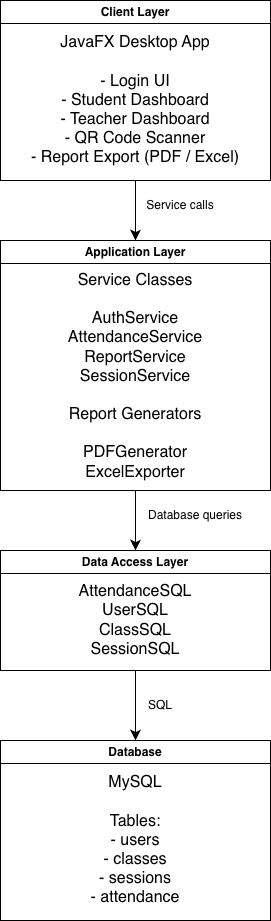
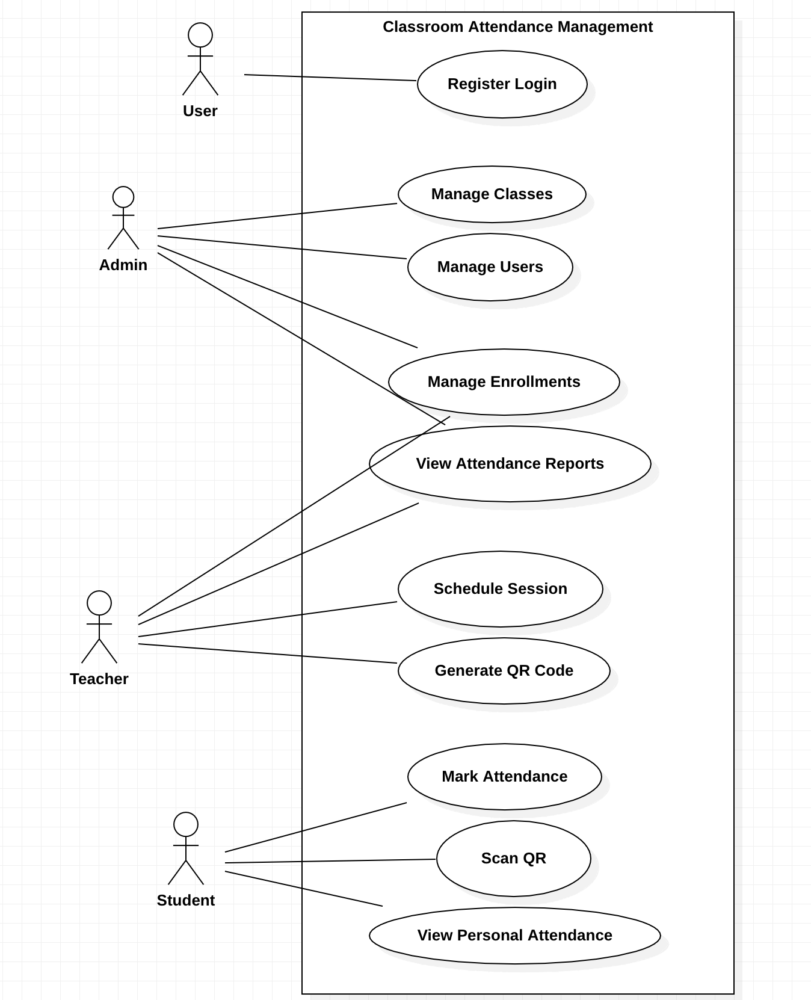
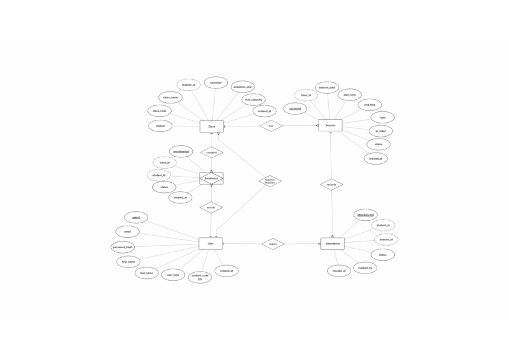

# Classroom Attendance Management System

## Project Description

The Classroom Attendance Management System is an application designed to manage student attendance in an educational institution. The system supports three main user roles: **Admin, Teacher, and Student**.

Teachers can start sessions and manage attendance records, while students can submit attendance using a QR code or manual marking. The system tracks attendance data for each session and class, allowing administrators and teachers to generate detailed attendance reports.

The application also provides **PDF report generation** for attendance summaries, enabling users to download and analyze attendance statistics.

This project demonstrates the use of **Java backend architecture, database integration, report generation, and UML system design**.

---

## Features

### Admin
- Manage users (students and teachers)
- View overall attendance statistics
- Generate school-wide reports
- Export reports to PDF

### Teacher
- Manage classes and sessions
- Mark student attendance
- Generate class attendance reports
- View student attendance statistics

### Student
- Submit attendance using QR code or manual entry
- View personal attendance records
- Download attendance reports

---

## System Architecture

The system follows a **layered architecture** consisting of:  

The use case and ER diagrams for the system are as follows:
- Use Case Diagram: 
- ER Diagram: 

---

## Tools and Technologies Used

### Programming Language
- Java

### Build Tool
- Maven

### Database
- MySQL

### Libraries
- **OpenPDF / Lowagie** – PDF report generation
- **ZXing** – QR code generation for attendance
- **JUnit** – Unit testing
- **JaCoCo** – Code coverage reporting
- **JavaFX** – Frontend UI development

### Development Tools
- IntelliJ IDEA
- StarUML (UML diagrams)
- ERDPlus (Database schema design)
- Git / GitHub (version control)

---

## Maven Manifest File (pom.xml)

This project uses **Apache Maven** as the build automation and dependency management tool. Maven manages project dependencies, compiles the source code, runs tests, and packages the application.

The system is structured as a **multi-module Maven project**, separating the frontend and backend components to improve modularity and maintainability.

### Project Modules

#### Frontend Module

The **frontend module** contains the graphical user interface built using **JavaFX**. It provides the interface through which users interact with the system.

Main responsibilities:
- Display user interface components
- Allow teachers and students to interact with the system
- Scan QR codes for attendance
- Communicate with backend services

Key dependencies used in the frontend module include:

- **JavaFX** – user interface framework
- **ZXing** – QR code scanning
- **Jackson** – JSON data processing
- **JUnit / TestNG** – testing frameworks

#### Backend Module

The **backend module** contains the business logic and database access layer of the system.

Main responsibilities:
- Manage users, classes, and sessions
- Process attendance records
- Generate reports
- Handle authentication and security

Key dependencies used in the frontend module include:

- **MySQL Connector** – database connectivity
- **Jackson** – JSON serialization/deserialization
- **Java JWT** – authentication using JSON Web Tokens
- **Spring Security Crypto** – password hashing
- **JUnit / TestNG** – unit testing

---

## Sprint Reports

All sprint planning and review documentation can be found in the following folder:

https://github.com/bhandari-sachin/Classroom-Attendance-Management-System/tree/main/reports